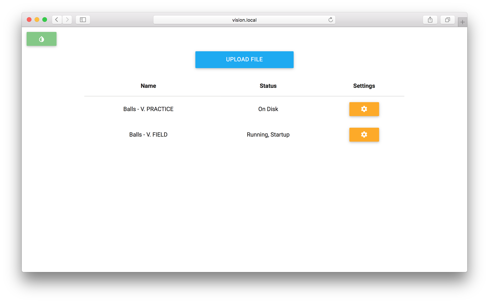

# Pigeon
Web interface for FRC's [GRIP](https://github.com/WPIRoboticsProjects/GRIP).

**[Installation Instructions](https://github.com/codetheweb/Pigeon/wiki/Linux-Installation)**

## Why Pigeon?
- Can be used offline
- Easy to upload, test, run, and add to startup different GRIP scripts
- Blazing fast
- Uses (for the most part) an MVC structure making it easier to maintain and read - no ugly files with PHP and HTML combined!
- All around awesomeness!

**NOTE: Please use a UPS**.  Without one your single board computer may shut down with the incorrect status or become corrupted.  Tips on using a UPS can be found on the [Wiki](https://github.com/codetheweb/Pigeon/wiki/UPS).

## Q&A
#### Why PHP?
The only other major option, in my mind, is NodeJS.  And while that's hip and cool, I've found it
- Time consuming and hard to install on embeded ARM platforms
- Uses more resorces than Apache + PHP

Plus, PHP makes it ridiculously easy to execute system commands.

#### Java runs in the browser, so are there any plans to add the GRIP source as a Java applet?
Probably not.  The source for GRIP clocks in at over 100 MBs, mostly because they included OpenCV with it.  It might work if someone made a 'Lite' version that consists of just a frontend that communicates with the server.

#### Why are config files for GRIP stored in a root directory (`/grip-config`)?
They're stored there so that if you want to upgrade Pigeon by trashing `/var/www/html` and re-cloning, you won't lose the files.

#### This isn't very secure, is it?
That doesn't sound like a question :smile:.  No, it's not.  By crafting a special filename and giving it to `/helper.php`, an attacker could execute anything they wanted.  I haven't focused on security, because most FRC teams are not a target.  But if someone wants to make this more secure, they're more than welcome.

#### How can I thank you?!?
Give back to the community.  Fork this, add in a feature you've always wanted, and open a pull request.  That's how open source projects get better.  If that's not enough for you, here's my Bitcoin address: `1574xswbQG1SxxMvtMu1cqsSA3UWy7WzS7`.
